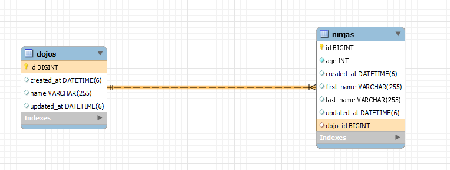
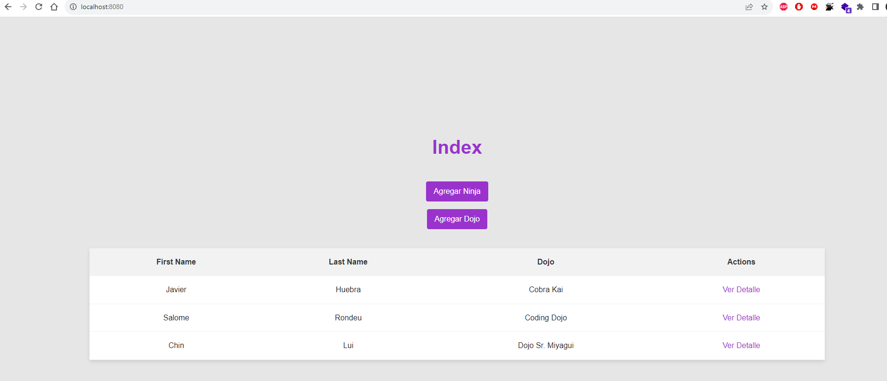
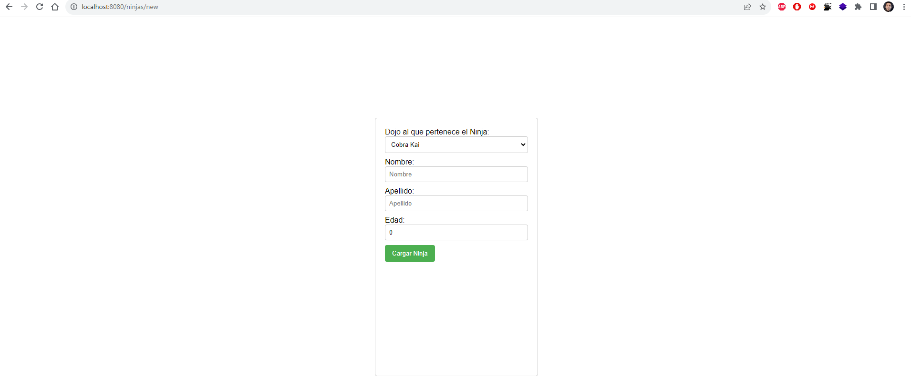
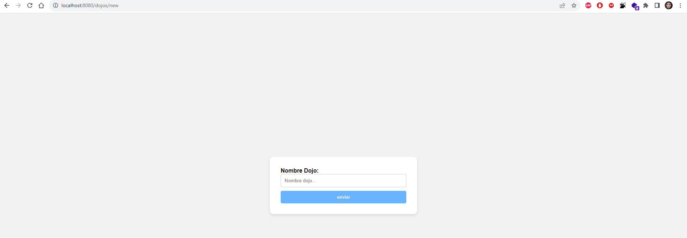
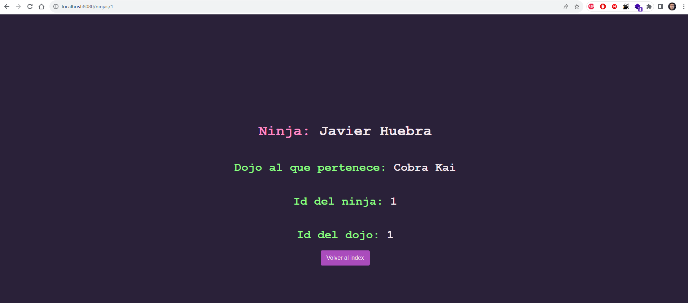

# Dojos y Ninjas - aplicación monolítica MVC - Coding Dojo Spring Data II

### En este proyecto se trabajó con una base de datos MySql y dos tablas vinculadas por el ORM con SpringBoot
Se registran Dojos y luego ninjas que pertenecen a esos Dojos, la relación entre las tablas es OneToMany (1 a N)

### Características

- Relación entre dos tablas en la base de datos SQL
- Thymeleaf como dependencia para el front

  
  

